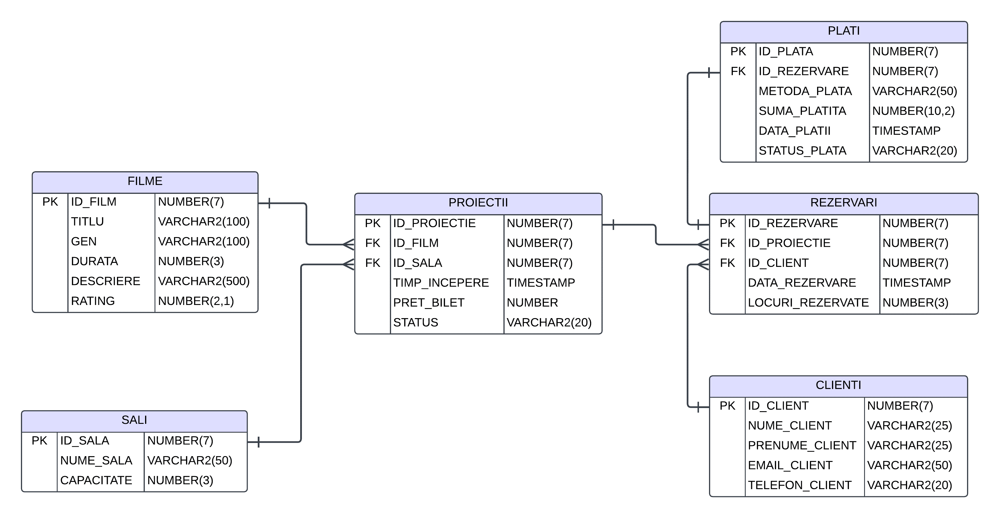

# Cinema Management Database System

## Overview
This SQL-based database system is designed to efficiently manage the operations of a cinema. It tracks essential data such as movie schedules, ticket reservations, and payments. This system provides the necessary infrastructure to streamline cinema management and generate useful reports to support decision-making.

